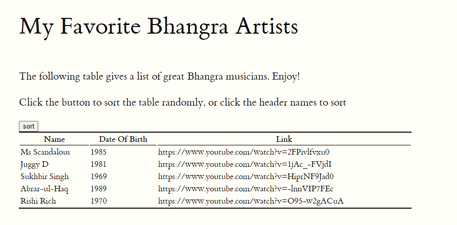

An article explaining my solution to the Sorting a Table problem.

<!--more-->

## The Problem

You can find the problem here: https://csc324docs.netlify.app/jsapps/sort/


<blockquote>
In this assignment you add some buttons to the table you created and populated in the previous assignment. You will practice handling events in JavaScript.

In order to prepare for this exercise, read Chapter 15 of Eloquent JavaScript.

Starting from the site that populates a table of Bhangra artists, add three buttons:

a button that when clicked will sort the artists by name;
a button that when clicked will sort the artists by year of birth;
a button that when clicked will randomly shuffle the rows of the original table.
</blockquote>


Here is the my index.html solution file code:

```javascript
<!DOCTYPE html>
<html xmlns="http://www.w3.org/1999/xhtml" xml:lang="en" lang="en-us">

<head>
  <title>CSC 324 | Table Assignment</title>
  <meta http-equiv="content-type" content="text/html; charset=utf-8">
  <!-- Enable responsiveness on mobile devices-->
  <meta name="viewport" content="width=device-width, initial-scale=1.0">
  <meta name="description" content="Table assignment for CSC 324 at Georgetown College, Kentucky.">
  <meta name="keywords" content="computer science web javascript">
  <!-- styles -->
  <link rel="stylesheet" href="css/tufte.css">
</head>

<body>
  <article>
    <h1>My Favorite Bhangra Artists</h1>
    <section>
      <p>
        The following table gives a list of great Bhangra 
        musicians.  Enjoy!
      </p>
      <p>Click the button to sort the table randomly, or click the 
        header names to sort </p>
        <th class="button"><button class="my-btn" type="button" onclick="sortTables()">
          sort</button></th>
      <table id="bhangra">
        <tr>
          <th onclick="sortTable(0)">Name </th>
          <th onclick="sortTable(1)">Date Of Birth </th>
          <th> Link </th>
        </tr>
      </table>
      <script>
        function sortTable(n) {
          var table, rows, switching, i, x, y, shouldSwitch, dir, switchcount = 0;
          table = document.getElementById("bhangra");
          switching = true;
          dir = "asc"; 
          while (switching) {
            switching = false;
            rows = table.rows;
            for (i = 1; i < (rows.length - 1); i++) {
              shouldSwitch = false;
              x = rows[i].getElementsByTagName("TD")[n];
              y = rows[i + 1].getElementsByTagName("TD")[n];
              if (dir == "asc") {
                if (x.innerHTML.toLowerCase() > y.innerHTML.toLowerCase()) {
                  shouldSwitch= true;
                  break;
                }
              } else if (dir == "desc") {
                if (x.innerHTML.toLowerCase() < y.innerHTML.toLowerCase()) {
                  shouldSwitch = true;
                  break;
                }
              }
            }
            if (shouldSwitch) {
              rows[i].parentNode.insertBefore(rows[i + 1], rows[i]);
              switching = true;
              switchcount ++;      
            } else {
              if (switchcount == 0 && dir == "asc") {
                dir = "desc";
                switching = true;
              }
            }
          }
        }
      </script>
    </section>
  </article>
  <script src="js/custom.js"></script>
</body>

</html>
```


Here is the my custom.js solution file code:

```javascript
/********************************************************************
 * 
 * Your introductory remarks go here.
 * 
 *******************************************************************/

 // The array of objects, one object for each artist.
 
 const artists = [
   {
     name: "Ms Scandalous",
     birthYear: 1985,
     link: "https://www.youtube.com/watch?v=2FPivlfvxu0"
   },
   {
    name: "Juggy D",
    birthYear: 1981,
    link: "https://www.youtube.com/watch?v=1jAc_-FVjdI"
  },
  {
    name: "Sukhbir Singh",
    birthYear: 1969,
    link: "https://www.youtube.com/watch?v=HiprNF9Jad0"
  },
  {
    name: "Abrar-ul-Haq",
    birthYear: 1989,
    link: "https://www.youtube.com/watch?v=-lnnVIP7FEc"
  },
  {
    name: "Rishi Rich",
    birthYear: 1970,
    link: "https://www.youtube.com/watch?v=O95-w2gACuA"
  }
 ]

 let tablefill = function(table, data) {
for(let element of data) {
let row = table.insertRow();
for (m in element) {
  let box = row.insertCell();
  let text = document.createTextNode(element[m]);
box.appendChild(text);
}
}
 }

 let table = document.querySelector("#bhangra");
 let data = Object.keys(artists[0]);
tablefill(table,artists);

function sortTables() {
  let table = document.getElementById("bhangra");
  let rowsCollection = table.querySelectorAll("tr");
  let rows = Array.from(rowsCollection)
    .slice(1); 
  shuffleArray(rows);
  for (const row of rows) {
    table.appendChild(row);
  }
}

function shuffleArray(array) {
  for (var i = array.length - 1; i > 0; i--) {
    var j = Math.floor(Math.random() * (i + 1));
    var temp = array[i];
    array[i] = array[j];
    array[j] = temp;
  }
}


```

i will go throgh this piece by piece 

``` javascript
function sortTables() {
  let table = document.getElementById("bhangra");
  let rowsCollection = table.querySelectorAll("tr");
  let rows = Array.from(rowsCollection)
    .slice(1); 
  shuffleArray(rows);
  for (const row of rows) {
    table.appendChild(row);
  }
}
```
this is the code that actually randomizes the code when you push the sort button, it also calls on the `suffleArray` function that is in the next chunk i will talk about.

``` javascript
function shuffleArray(array) {
  for (var i = array.length - 1; i > 0; i--) {
    var j = Math.floor(Math.random() * (i + 1));
    var temp = array[i];
    array[i] = array[j];
    array[j] = temp;
  }
}
``` 
this is the function that i talked about in my last chunk, this is the actual code that is randomizing the sorting of the table. 

``` javascript
        <th class="button"><button class="my-btn" type="button" onclick="sortTables()">
          sort</button></th>
      <table id="bhangra">
        <tr>
          <th onclick="sortTable(0)">Name </th>
          <th onclick="sortTable(1)">Date Of Birth </th>
          <th> Link </th>
```
this is in my `index.html`, the `class = "button"` part is the randomize button that i created that runs the `sorttables` code from my `custom.js`. the `onclick="sortTable"` is my code that makes it so when you click on the `name` or `Date of Birth` header name, it sorts based on which one you clicked.

``` javascript
      <script>
        function sortTable(n) {
          var table, rows, switching, i, x, y, shouldSwitch, dir, switchcount = 0;
          table = document.getElementById("bhangra");
          switching = true;
          dir = "asc"; 
          while (switching) {
            switching = false;
            rows = table.rows;
            for (i = 1; i < (rows.length - 1); i++) {
              shouldSwitch = false;
              x = rows[i].getElementsByTagName("TD")[n];
              y = rows[i + 1].getElementsByTagName("TD")[n];
              if (dir == "asc") {
                if (x.innerHTML.toLowerCase() > y.innerHTML.toLowerCase()) {
                  shouldSwitch= true;
                  break;
                }
              } else if (dir == "desc") {
                if (x.innerHTML.toLowerCase() < y.innerHTML.toLowerCase()) {
                  shouldSwitch = true;
                  break;
                }
              }
            }
            if (shouldSwitch) {
              rows[i].parentNode.insertBefore(rows[i + 1], rows[i]);
              switching = true;
              switchcount ++;      
            } else {
              if (switchcount == 0 && dir == "asc") {
                dir = "desc";
                switching = true;
              }
            }
          }
        }
      </script>
```
this is in my `index.html`, this is the code that gets run when you click on the header name to sort. for the names it goes A-Z and if you click it again it goes Z-A. for the dates it does the same thing just with numbers.

Here is what the final table looks like when produced into a website.


