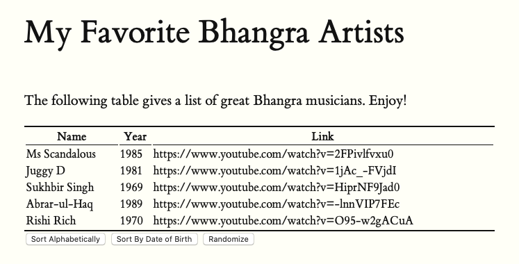

<blockquote>

In this assignment you add some buttons to the table you created and populated in the previous assignment. You will practice handling events in JavaScript.

In order to prepare for this exercise, [read Chapter 15 of _Eloquent JavaScript_](https://eloquentjavascript.net/15_event.html).

Starting from the site that populates a table of Bhangra artists, add three buttons:

* a button that when clicked will sort the artists by name;
* a button that when clicked will sort the artists by year of birth;
* a button that when clicked will randomly shuffle the rows of the original table.

*The table should look like this:*


 

</blockquote>


```Javascript
const artists = [
   {
     name: "Ms Scandalous",
     birthYear: 1985,
     link: "https://www.youtube.com/watch?v=2FPivlfvxu0"
   },
   {
    name: "Juggy D",
    birthYear: 1981,
    link: "https://www.youtube.com/watch?v=1jAc_-FVjdI"
  },
  {
    name: "Sukhbir Singh",
    birthYear: 1969,
    link: "https://www.youtube.com/watch?v=HiprNF9Jad0"
  },
  {
    name: "Abrar-ul-Haq",
    birthYear: 1989,
    link: "https://www.youtube.com/watch?v=-lnnVIP7FEc"
  },
  {
    name: "Rishi Rich",
    birthYear: 1970,
    link: "https://www.youtube.com/watch?v=O95-w2gACuA"
  }
 ];
```

<!--more-->
<h2>My Solution</h2>


**index.html**

This document holds the content needed to publish the website online. 
```Javascript
<!DOCTYPE html>
<html xmlns="http://www.w3.org/1999/xhtml" xml:lang="en" lang="en-us">

<head>
  <title>CSC 324 | Table Assignment</title>
  <meta http-equiv="content-type" content="text/html; charset=utf-8">
  <!-- Enable responsiveness on mobile devices-->
  <meta name="viewport" content="width=device-width, initial-scale=1.0">
  <meta name="description" content="Table assignment for CSC 324 at Georgetown College, Kentucky.">
  <meta name="keywords" content="computer science web javascript">
  <!-- styles -->
  <link rel="stylesheet" href="css/tufte.css">
</head>

<body>
  <article>
    <h1>My Favorite Bhangra Artists</h1>
    <section>
      <p>
        The following table gives a list of great Bhangra 
        musicians.  Enjoy!
      </p>
      <table id="bhangra">
        
      </table>
      <div id="buttons">
        <button id="alpha-button">Sort Alphabetically</button>
        <button id="date-button">Sort By Date of Birth</button>
        <button id="random-button">Randomize</button>
    </div>
    </section>
  </article>
  <script src="js/custom.js"></script>
</body>

</html>
```

This document is split into two main sections: the header and the footer. Located within the `<head></head>` tags, the header communicates with the tufte.css document. It is used to define the style and format of the website. 

The second section is the body, located within the `<body></body>` tags. We can tell that the content on this page are in the form of an article. The heading tags `<h1></h1>` show that the title will be "My Favorite Bhangra Artists". Next we see a section tag `<section></section>` holding paragraph, table, and div tags. The paragraph tag `<p></p>` is used for normal text and has a breif description of the page, "The following table gives a list of great Bhangra musicians. Enjoy!". The table tag `<table></table>` has an id set to "bhangra", but no content inside the tag. The tag id is used to signal where other documents should insert certain data. Next, the div tag `<div></div>` is where the button functions will enter into the document; hence the tag id set to "buttons". Inside, there are thre `<button></button>` tags, but each have a different id and text.

Below the closing article tag `</article>`, we see a script tag `<script src="js/custom.js"></script>` which tells the document to look inside the custom.js document inside the js folder. 


**custom.js**

```javascript
// No Button
    const listDiv = document.querySelector("#bhangra");

    let contents = "";
    let heading = "<tr><th>Name</th><th>Year</th><th>Link</th></tr>";
    contents += heading;
    artists.forEach(function(artist) {
    contents += `<tr><td>${artist.name}</td><td>${artist.birthYear}</td><td>${artist.link}</td></tr>`;
    })

    listDiv.innerHTML = contents

// Event listeners
    // Alphabetical Order
    const alphaButton = document.querySelector("#alpha-button");
    alphaButton.addEventListener("click", function() {
    listDiv.innerHTML = makeListContents(artists.sort(byName));
    });

    // Order by date
    const dateButton = document.querySelector("#date-button");
    dateButton.addEventListener("click", function() {
    listDiv.innerHTML = makeListContents(artists.sort(byDate));
    });

    // Random Order
    const randomButton = document.querySelector("#random-button");
    randomButton.addEventListener("click", function() {
    listDiv.innerHTML = makeListContents(artists.shuffle());
    });


/********************************************************************
 * 
 * Helper Functions below.
 * 
 *******************************************************************/

// Order by Name
function byName(a, b) {
  if (a.name < b.name) return -1;
  if (a.name > b.name) return 1;
  return 0;
 }

// Order by Date
function byDate(a, b) {
  if (a.birthYear < b.birthYear) return -1;
  if (a.birthYear > b.birthYear) return 1;
  return 0;
 }

// Shuffle the artists randomly:
Array.prototype.shuffle = function() {
  let input = this;
  for (let i = input.length-1; i >= 0; i--) {
    let randomIndex = Math.floor(Math.random()*(i+1)); 
    let itemAtIndex = input[randomIndex]; 
    input[randomIndex] = input[i]; 
    input[i] = itemAtIndex;
  }
 return input;
};

// Insert into html string
function makeListContents(arr) {
  let newContents = heading
  arr.forEach(function(element) {
    newContents += `<tr><td>${element.name}</td><td>${element.birthYear}</td><td>${element.link}</td></tr>`;
  });
  return newContents;
}
```

The code above is split into three sections: No button, event listeners and helper functions.

**No Button**

This section is used to generate the table prior to any button being pressed. It begins be setting the const variable `listDiv` equal to a query selector, searching for an html tag with the id "bhangra". Next, we create an empty string variable called `contents`, the table data will be added into the string and inserted into index.html when the code is run. This can be seen in the next four lines. Another string variable `heading` is composed of the table headers written out in html using table row `<tr></tr>` and table header `<th></th>` tags, then added into `contents`. 

The array `artists` and its method forEach are run through a function with the parameter `artist`. This means that each element of `artists` will go through the function. Inside the function, the table content is put into an html string of table row `<tr></tr>` and table data `<td></td>` tags, then added into `contents`. Inside each row, there are three table data tags that each call a different property of the element in question. For example, the first element of `artists` is an element with three properties: name = Ms. Scandalous, birthYear = 1985, and link = "https://www.youtube.com/watch?v=2FPivlfvxu0". Thus, the table's second row will have all three properties inside. 

Once all elements go through the function and are added as an html string into `contents`, the variable `listDiv` and the property innerHTML is set equal to `contents`. This is how the table, in the form of an html string, is sent back to index.html


**Event Listeners** 

This section is where we create each of the three buttons. The code for each button is relatively similar, but a few changes in each. 

The first button is designed to reorder the table in alphabetical order by name. The const variable `alphaButton` is created as a querySelector looking for a tag id equal to "alpha-button". The next line creates an eventListener for `alphaButton`, it takes an action "click" and a command. The command is a function that sets `listDiv.innerHTML` equal to the function `makeListContents(artists.sort(byName))`. The sort() method inside the function will reorder the elements inside the array in place. The function will be further discussed in the Helper Function section, but for now it is important to know that the function's result will be sent to index.html to replace the current table. 

The second button is almost identical in structure except for the const variable is names `dateButton`, the tag id is "date-button", and the function inside the event listener returns `makeListContents(artists.sort(byDate))` into index.html. This button is meant to reorder the table by artist birth year. The third button uses the same structure; yet, its const variable is named randomButton, the querySelector is looking for a tag id of "random-button", and the event listener returns the result of the function `makeListContents(artists.shuffle())`. The biggest difference in this button is found in the parameter of `makeListContents()`, instead of artist.sort(), it uses artist.shuffle(). This is because the third button randomizes the table rows, the shuffle method was created to do so.

In short, all three buttons are designed to recognize that the button was clicked, run a function, then replace the current table with the results of the function. The functions called will be outlined in the follwoing section.

**Helper Functions**

*byName*

There are three functions and a shuffling method listed in the helper functions section. The first is `byName` and was called inside the sort() method above in the function for `alphaButton`. It is designed to reorder the elements in place. The function has two parameters `a` and `b`, so when an array is inserted into the function, the first two elements will fill in the values for `a` and `b`. Thus, if the name property of `a` is less than the name porperty of `b`, then the function will return -1. This tells the sort command that `a` comes before `b` and shoud be moved into a lower index. If `a` is greater than `b`, 1 will return and the sort method knows to move `a` to a higher index. If the two are equal, 0 will return and the sort method knows not to move either variable. After each element is compared to each other, the list will be correct and the function can stop. 

*byDate*

The second button also used the sort method, however, it called `byDate` instead - the second helper function. It uses the exact same methodology as `byName`, except instead of comparing the name property of each element it compares the birthYear property of each element. The first time the function is run, `a` will be equal to 1985 and `b` will be equal to 1981. Since 1985 is greater, the function will return 1 and the sort method will know to move `a` into a higher index. By doing this, the function reorders each element in the table by the artists birth year. My understanding of the `byName` and `ByDate` functions was further developed from [this webpage](https://developer.mozilla.org/en-US/docs/Web/JavaScript/Reference/Global_Objects/Array/sort). 

*shuffle*

The next code chunk creates a shuffle method for an array. It does this by taking the `Array` prototype and adding the shuffle method equal to a function. Inside the function, the variable `input` is equal to `this`. The following for loop is designed to create an iterator `i` that starts at the last element, or `input`-1, and ends when `i` is 0 or below. `i` will decrease by 1 every loop.

Inside the loop, we see:

`let randomIndex = Math.floor(Math.random() * (i + 1));`

`let itemAtIndex = input[randomIndex];`

The former is a variable set equal to a random number generator; however, the highest number that can be generated is the current placement of `i`. So if the loop is on `i` = 5, 5 is highest possible number that will return. The latter line will take that randomly generated number, find the element in `input` at the position and store it in the `itemAtIndex` variable. The next two lines are seen below:

`input[randomIndex] = input[i];` 

`input[i] = itemAtIndex;`

These two lines are meant to swap the values of the randomly selected element and the element at position `i`. In the former line, the element in `input` at position `randomIndex` is set equal to the element of `input` at position `i`. The next line sets the element of `input` at position `i` equal to `itemAtIndex`, which is still equal to `input[randomIndex]`. Thus swapping the values. Input will be returned once the for loop has finished. 

*makeListContents*

Finally, the last function is `makeListContent`. The function is designed to take in an array `arr`, converts its contents into an html string, then return it back up to the `listDiv.innerHTML` commands to be sent to index.html. This process is very similar to the code mentioned in the first section, except the process needs to be repeated for every line. 

Inside the function, a new variable `NewContents` is created to hold `heading` made in the first chunk of code mentioned above. The next line runs the forEach method on `arr`. The string includes a table row tag `<tr></tr>` and three table data tags `<td></td>`. The properties in each element of `arr`, the name, birthYear, and link properties are inserted into the table data tags. Then the entire table row is saved into `newContents` along with `header`. The same will happen until all elements have gone through, then the function will return `newContents`.

This means that whenever a button is pushed, that buttons respective sorting or shuffle method is run, then returned into `makeListContents`. The resulting html string is then sent to `listDiv.innerHTML` to be inserted into index.html at the table tag with the id "bhangra". 
