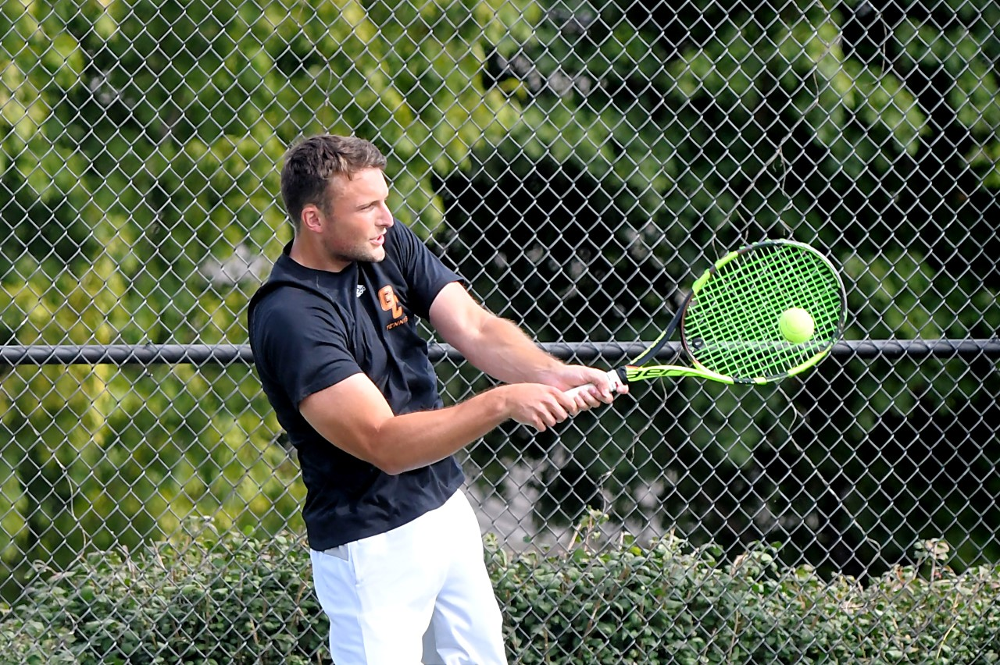









Hey Guys! My name is Hunter Nosek. I am a senior tennis player here at Georgetown College. My major is Mathematics and my minor is Computer Science. 

## About Me

I was born in Nebraska, which is where my Mom and Dad are met. My dad's side of the family has been around Omaha for their whole lives, while my mom's side of the family is from Kansas. I lived in Omaha for the first two years of my life before moving to Grand Rapids, Michigan.

I consider Grand Rapids the place where I grew up, since I was there throughout elementary school. This is when I picked up tennis, and have been playing it pretty consistently ever since. When I was twelve, My dad's job trasferred us to Cincinnati, which is where I went to high school.

 Since my older brother and I were fortunate to be good enough to play tennis at the next level, we were looking for colleges near us that we could play at. My brother chose to play at Georgetown College, and I decided to follow, which is how I ended up here.

Math is something that has (for the most part) always come natural for me, and I really enjoy it. I'm looking into actuarial science right now, and also have a big interest in data analysis and data science.

My parents and brother are living in Nashville now, which is where I spent the bulk of my time during Quarantine. I love it down there and will most likely live there after I graduate in May.

I really enjoyed the web design course that I took last fall and am very excited to learn more about building websites and the javascript language. 

## Things I Like

<ul>
<li>Video Games</li>
<li>Weight Lifting</li>
<li>Watching Sports</li>
<li>Sandwiches</li>
<li>Outdoors</li>
<li>Math & Computer Science</li>
</ul>


## Things I Dislike

<ul>
<li>Covid</li>
<li>Cold Weather</li>
<li>Watermelon</li>
<li>Last Season of Game of Thrones</li>
</ul>


