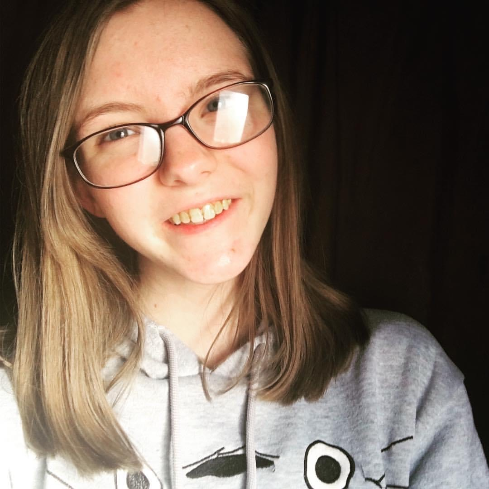
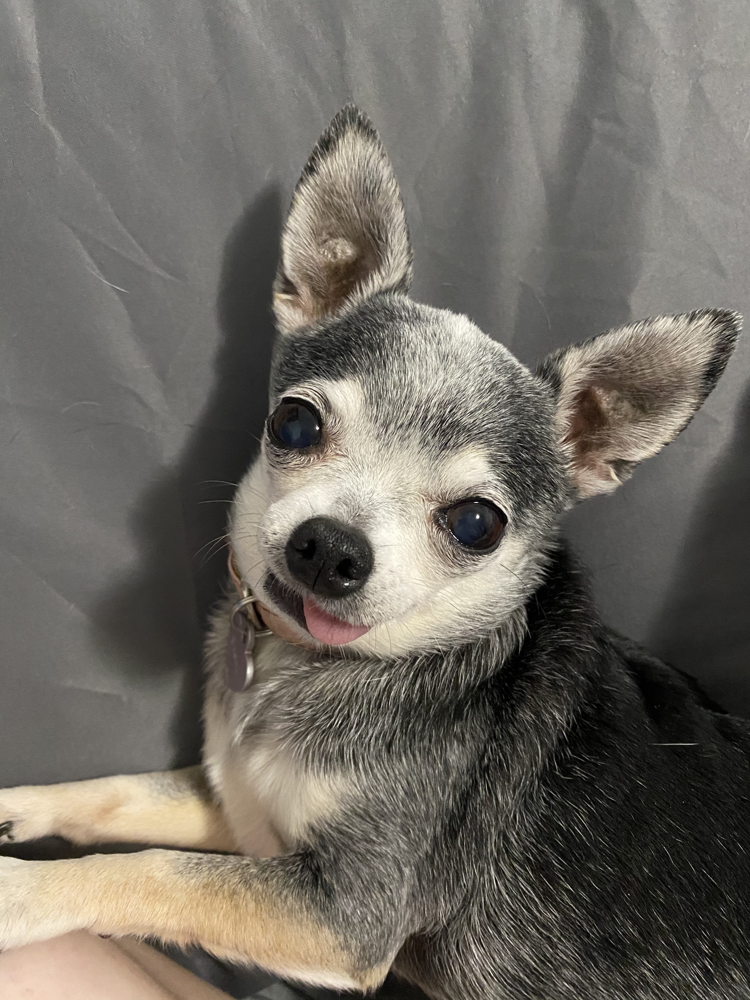
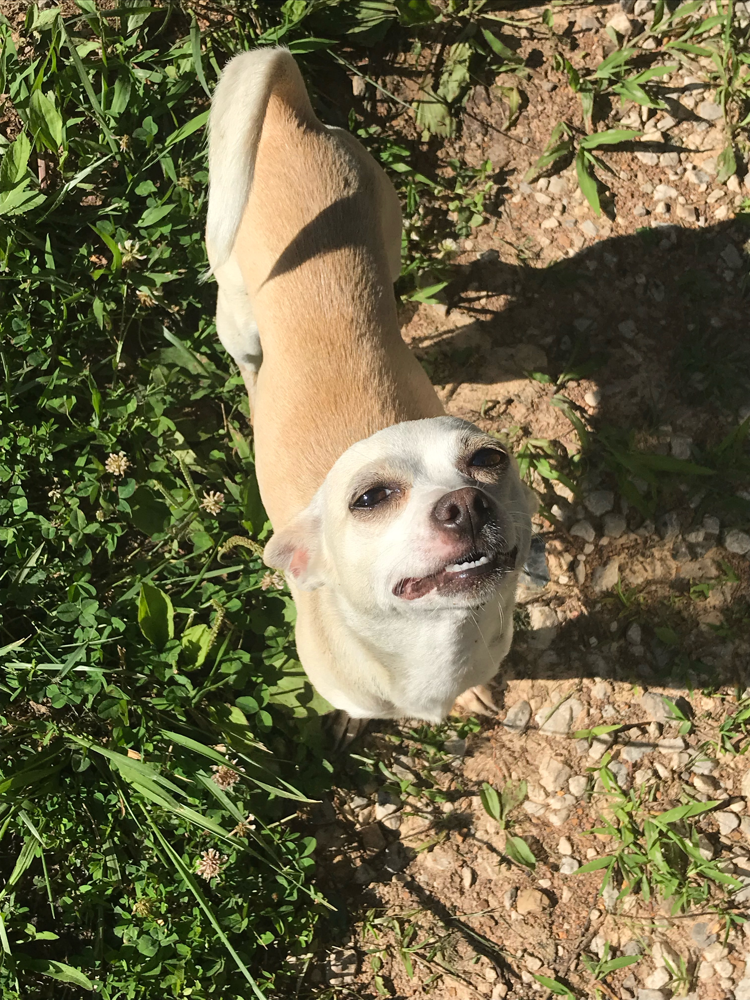









Hello! I am Kaitlyn Brewer. I am a senior Environmental Science major and Computer Science minor at Georgetown College. I am the president of Georgetown Sustainability Initiative (GSI) and I have worked in
the biology labs for 4 years as a lab assistant and TA. I am (kind of) in the science honors program.

<!--more-->

After graduation, I want to attend graduate school, though I am not sure where or for what quite yet. *I really need to figure that out.*  My main academic interets are:
* [Ecological succession](https://en.wikipedia.org/wiki/Ecological_succession), 
* invasive and endangered species, 
* and botany. 

## Just Some Fun Facts 

    

I have two dogs (Sasha and Poly), and they are great! I have had Sasha (the black one) since she was a puppy and she is 11 years old. Poly (the sort of blonde one) is a rescue, but I have had her for about 5 years. 
In my freetime, I love watching movies, especially 80's and 90's movies. My favorite movies, however, are any and all of the Muppet's movies. Just for fun, I am going to try to include a YouTube video that is the trailer for The Muppet Movie (1979): 



