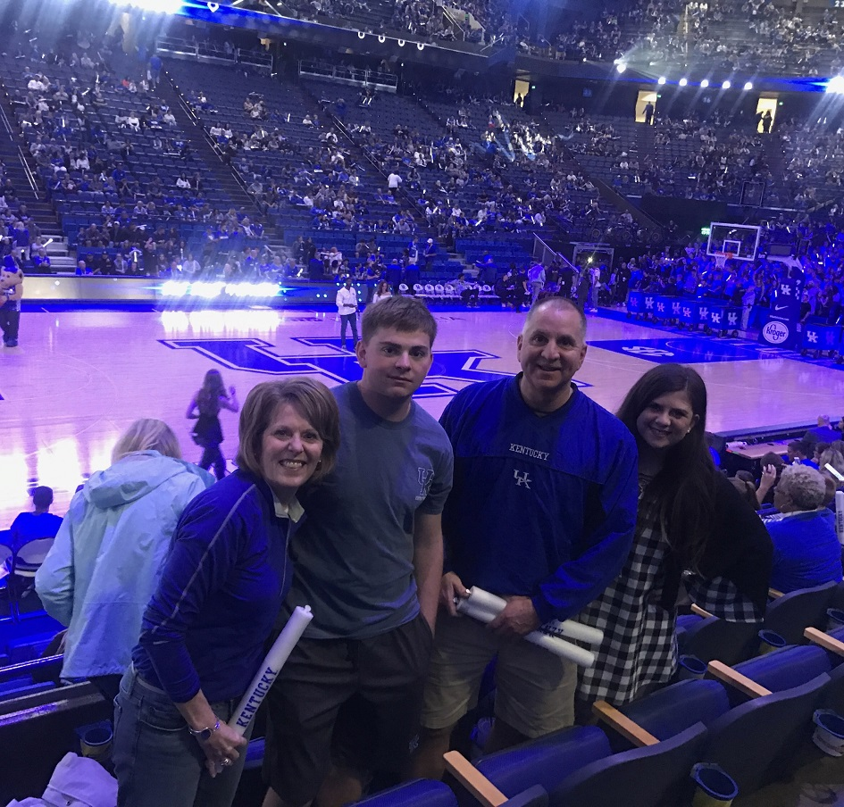









Hello, Im Matt. I am a junior at Georgetown College and play Baseball.

## About Me

I was born in lexington, Kentucky. Most of my family is from Kentucky, while not all decided to stay in Kentucky. We all seem to want to come back to where we know and love.

I would of added a picture from baseball here but I wish I had one to add. All most 2 years ago, I had surgery on my eblow repairing my UCL. This has kept me from being able to play even though i have been on the team since I got to Georgetown. My sister played college golf at a division 2 school in south carolina by the name of coker. She to at one point had to have surgey while hers being on her knee it was just as bad.

Computer science/coding has come natually to me. I have never really had an issue catching on when it comes to technology and coding. Where I go from this class im not really sure at this point but I hope to know soon.

my sister who I talked about before lives in lexington and works for UK PR team. My parents live in lexington aswell in the same house that they lived in when I was born.

## Things I Like

<ul>
<li>Video Games</li>
<li>Working Out</li>
<li>Watching Sports</li>
<li>Baseball</li>
<li>Outdoors</li>
</ul>


