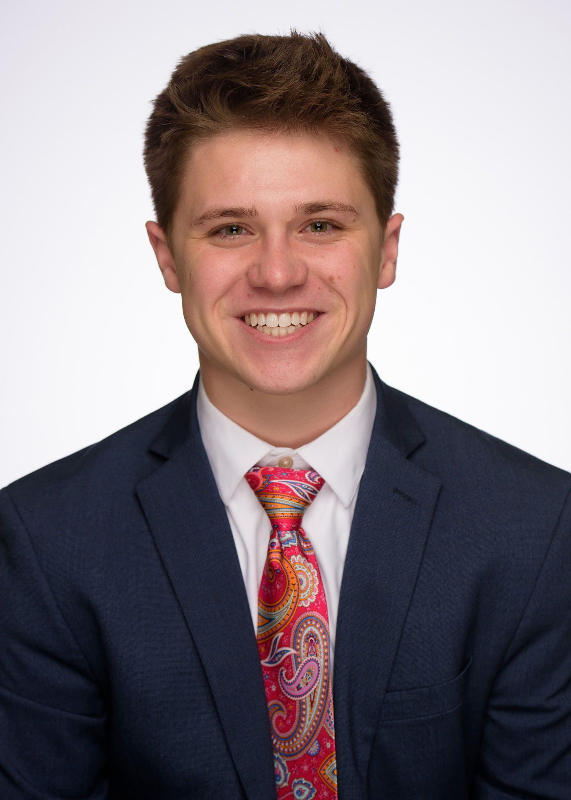
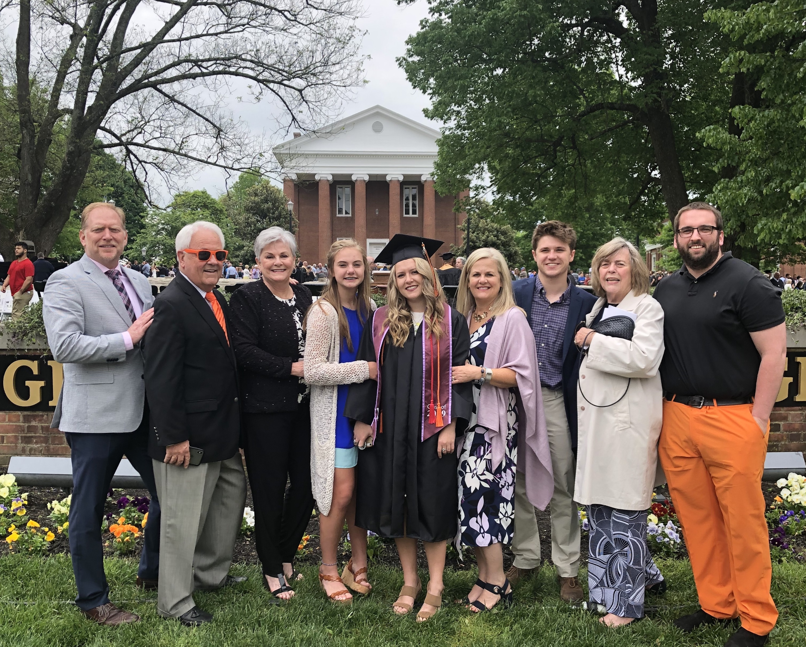
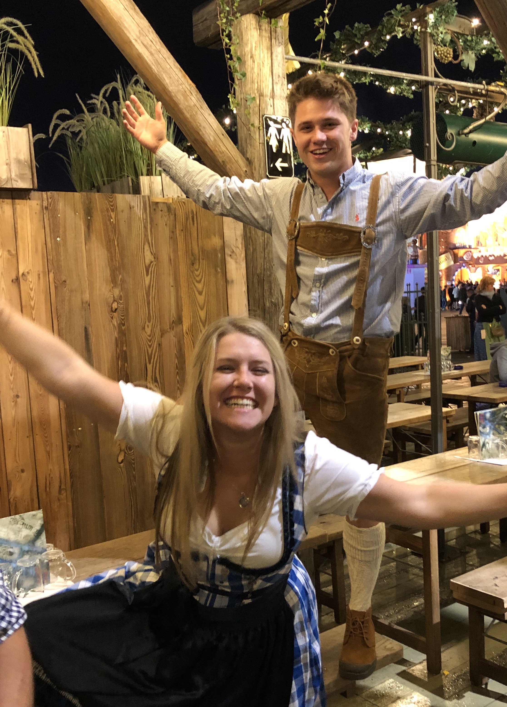

Hello, I'm Riley! I enjoy long walks on the beach, puppies, and turtles. 

<!--more-->









Currently, I am a senior at Georgetown College pursuing a double major in Finance and Economics. Over the course of my time at Georgetown, my plans for the future have changed dramatically. At one point or another, I have considered Law School, Masters in Finance, Masters (maybe PhD) in Ecnomics, Masters in Data Science (Recently), dropping out of school entirely to develope Real Estate, taking the CFA exam, etc. While I have vetoed several of those over time, I know that I want to eventually get a masters degree in either Finance/Econ or Data Science. Thus, with only a few months left of college, my plan is to apply for every possible internship, job, or masters program that I possibly can. 

*But how did I get here?*

 I was born and raised in Louisville, KY. I have two sisters, one older and one younger. In the picture on the left, my older sister Elliot is seen in her graduation gowns. With some contenxt clues, you may recognize the large brick building in the background to be Giddings Hall. If so, you'd be correct; other context clues include the "G" on the wall, and the bright orange pants. This picture was taken at the Georgetown College graduation ceremony in May 2019, the same time I had finished my sophomore year at the same institution. If you scan to the left of Elliot, you'll see my younger sister Ava. She is a sophomore in high school - also considering Georgetown. The two folks behind her are my Grandparents, Mimi and Boppa. On the far left is my dad, Brad. He is an architect and did not attend Georgetown. Back on the right side of Elliot, you'll see my momma, Niki. She is a second grade teacher, also did not attend Georgetown. Behind her is myself, then my other grandmother, Grandy. Lastly, on the far right, mentioned earlier in the bright orange pants, is Ian (Elliot's Boyfriend). Another GC Alumn. What a crew.

During high school, I spent most of my time practicing and playing with the school baseball team. After 16 years of baseball I reluctantly hung up my cleats upon my arrival at Georgetown. Without the additional time commitment of a collegiate sport, I began to join as many extracurricular activities as I could to fill my time outside of class – this is a relatively common practice for non athlete students at GC. During my first three years I held nine different roles on campus. In preparation for a busy senior year I limited myself to one role. My position as the Editor-in-Chief of the Georgetonian has taken up a hefty lot of time in the first few weeks. If you'd like to see what I've been working on, [check out this link!](www.georgetoniancom.wordpress.com)     

During my junior year, I had the opportunity to study abroad at the University of Oxford. I spent Michaelmas term developing relationships with people from cultures all over the world. Some of my favorite memories were from Friday night Formal Dinners because of the conversations with other students and professors. During my time, I studied Economics of Industry with [Dr. George Bitsakakis](https://uk.linkedin.com/in/georgebitsakakis), and Money and Banking with [Dr. Jacinta Pires](https://www.chch.ox.ac.uk/staff/dr-jacinta-pires). 

I will always be grateful that Elliot was able to miss work to drop me off at Oxford. We made a few stops along the way. This picture was taken in September 2019 at the original Oktoberfest festival held in Munic, Germany. It was a great time. I hope I am able to go back one day. 
